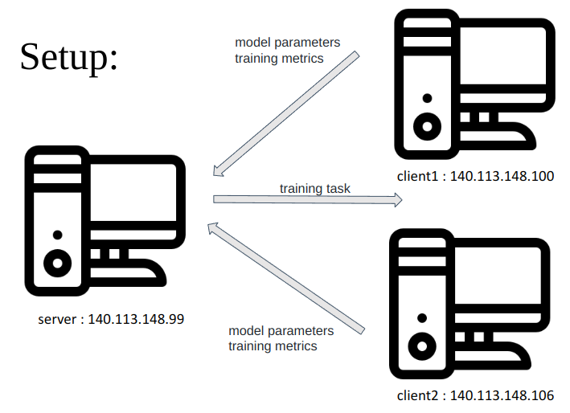

# Flower Example using TensorFlow/Keras

This introductory example to Flower uses Keras but deep knowledge of Keras is not necessarily required to run the example. However, it will help you understanding how to adapt Flower to your use-cases.
Running this example in itself is quite easy.

## Project Setup

Start by cloning the example project. We prepared a single-line command that you can copy into your shell which will checkout the example for you:

```shell
git clone --depth=1 https://github.com/adap/flower.git && mv flower/examples/quickstart_tensorflow . && rm -rf flower && cd quickstart_tensorflow
```

This will create a new directory called `quickstart_tensorflow` containing the following files:

```shell
-- pyproject.toml
-- client.py
-- server.py
-- README.md
```

Project dependencies (such as `tensorflow` and `flwr`) are defined in `pyproject.toml`. We recommend [Poetry](https://python-poetry.org/docs/) to install those dependencies and manage your virtual environment ([Poetry installation](https://python-poetry.org/docs/#installation)), but feel free to use a different way of installing dependencies and managing virtual environments if you have other preferences.

```shell
poetry install
poetry shell
```

Poetry will install all your dependencies in a newly created virtual environment. To verify that everything works correctly you can run the following command:

```shell
poetry run python3 -c "import flwr"
```

If you don't see any errors you're good to go!

## Run Federated Learning with TensorFlow/Keras and Flower

Afterwards you are ready to start the Flower server as well as the clients. You can simply start the server in a terminal as follows:

```shell
poetry run python3 server.py
```

Now you are ready to start the Flower clients which will participate in the learning. To do so simply open two more terminals and run the following command in each:

```shell
poetry run python3 client.py
```

Alternatively you can run all of it in one shell as follows:

```shell
poetry run python3 server.py &
poetry run python3 client.py &
poetry run python3 client.py
```

You will see that Keras is starting a federated training. Have a look to the [Flower Quickstarter documentation](https://flower.dev/docs/quickstart-tensorflow.html) for a detailed explanation. You can add `steps_per_epoch=3` to `model.fit()` if you just want to evaluate that everything works without having to wait for the client-side training to finish (this will save you a lot of time during development).

## ARG Setup

### Machines

* Server: 140.113.148.99
* Client1: 140.113.148.100
* Client2: 140.113.148.106

### Docker
* pip3 install flwr
* pip3 install tensorflow

### Expected Outputs
* INFO flower 2023-01-03 14:17:13,562 | server.py:144 | FL finished in 298.8903026818298
* INFO flower 2023-01-03 14:17:13,562 | app.py:192 | app_fit: losses_distributed [(1, 2.3118977546691895), (2, 2.3254003524780273), (3, 2.0776782035827637)]

### Code Analysis
The call to tf.keras.datasets.cifar10.load_data() downloads CIFAR10, caches it locally, and then returns the entire training and test set as NumPy ndarrays.
```shell
(x_train, y_train), (x_test, y_test) = tf.keras.datasets.cifar10.load_data()
```
use MobilNetV2 with 10 output classes
```shell
model = tf.keras.applications.MobileNetV2((32, 32, 3), classes=10, weights=None)
model.compile("adam", "sparse_categorical_crossentropy", metrics=["accuracy"])
```
The Flower server interacts with clients through an interface called Client, When the server selects a particular client for training, it sends training instructions over the network. The client receives those instructions and calls one of the Client methods to run your code
```shell
class CifarClient(fl.client.NumPyClient):
    def get_parameters(self, config):
        return model.get_weights()

    def fit(self, parameters, config):
        model.set_weights(parameters)
        model.fit(x_train, y_train, epochs=1, batch_size=32, steps_per_epoch=3)
        return model.get_weights(), len(x_train), {}

    def evaluate(self, parameters, config):
        model.set_weights(parameters)
        loss, accuracy = model.evaluate(x_test, y_test)
        return loss, len(x_test), {"accuracy": float(accuracy)}
```
We can now create an instance of our class CifarClient and add one line to actually run this client:
```shell
fl.client.start_numpy_client(server_address="[::]:8080", client=CifarClient())
```

### pseudocode
Algorithm: Distributed Training with Flower

Input: current model parameters, training config
Output: updated model parameters, training metrics

1. Server sends training task to client
2. Client performs training and returns updated model parameters and training metrics
3. Server updates its copy of the model with the updated parameters
4. Server updates its training metrics with the metrics returned by the client
5. Repeat steps 1-4 for multiple epochs or until convergence

### setup figure

